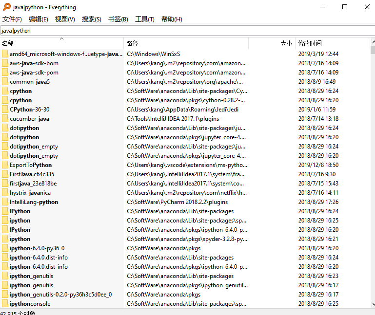

# Everything - 迅速帮你找到电脑上的Everything

## Everything是什么

Everything是一款在Windows平台上可以免费使用的轻量级小工具，软件安装包的大小不过1m多。用它可以对你本地电脑上的文件快速搜索。


## 为什么要使用Everthing
虽然Windwos已经自带了搜索本地文件的功能，但那堪比被限速的百度云的速度让人实在无法忍受。Windows自带的搜索之所以这么慢的原因是它不仅仅搜索了文件名，同样对文件中的内容进行了搜索，而Everything只对文件名进行索引。


但在我们绝大部分的使用场景中，都是基于文件名进行搜索而非内容。这时我们可以果断放弃Windows自带搜索，选择更快速的Everything。


## Everything的简单使用

### 安装Everything
* 官方下载地址：[请点击](https://www.voidtools.com/zh-cn/)
* 选择好安装路径后，直接按照默认配置下一步，在高级选项时勾选“集成到资源管理器上下文菜单”。


* 双击运行，大功告成。（初次使用扫描全盘文件会稍慢，以后再打开都可以做到秒开）

### 使用
**方法一:**

直接从桌面exe运行，在搜索框里输入你想要的文件即可，关键字、后缀名都是支持的。基本在你输入完内容那一刻就把结果展现出来了。


**方法二：**

你在windows资源管理器的某一层级目录下，点击右键选择搜索Everything，这样就是只在当前目录范围进行搜索


## 一些高级用法
除了搜索速度快之外，支持一些进阶的搜索方法也是Everything的亮点。简单掌握这些搜索方法，对提高我们模糊搜索的效率非常有帮助。这里先介绍几个最常用的。
### Everything中的布尔运算
**空格（与）**

有时候我们只能记住文件中一两个零散的关键字，为了搜索范围进一步缩小，我们可以使用空格同时对两个关键字进行搜索。Everything会为我们找到同时包含这两个关键字的文件(如果想要搜索的文件名中有空格时，可以为搜索内容加上双引号防止被everything认为是多个关键词)。

以下搜索语句将会搜索出文件名中包含test 并且包含 .py的文件/文件夹。
```
test .py
```

**|(或)**

当我们想要搜索包含多个关键字中任意一个的文件时，使用"|"符号即可。

以下搜索语句将会搜索出文件名中包含java 或者 python的文件/文件夹。
```
java|python
```


**!（非）**

当我们想要查找文件名中包含a字符但是又不包含b字符的文件时，可以通过"!"符号来实现。
以下搜索语句将会搜出只包含a而不包含b的文件/文件夹
```
a !b
```


### 通配符
*和?是两个非常常用的通配符，前者代表任意个数的任意字符，后者表示一个任意字符。
以下搜索语句将会搜出以p开头以n结尾的所有文件/文件夹
```
p*n
```


以下搜索语句将会搜出以r开头以p结尾，且**中间只有一个字符**的文件/文件夹
```
r?p
```

### 使用正则表达式
Everything甚至支持使用正则表达式搜索。我们需要先确认正则表达式的设置被启用。(搜索中勾选启用正则表达式或者CTRL+R快捷键启用)


正则语法使用起来虽然强大但是也会相对复杂，这里就不单独介绍。想要查看Everything支持的正则语法，大家可以从帮助-查看正则表达式语法中进行查阅。


如果你一直在忍受Windows自带搜索的龟速，那么看完文章赶紧体验一下Everything带给你的老司机车速吧。